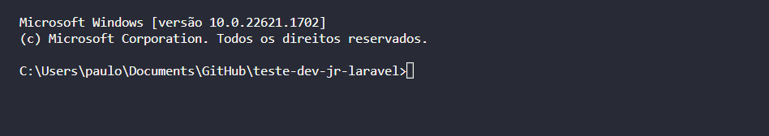
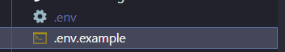

# Requisitos Mínimos

- Docker Engine instalado, para executar o Docker.

# Iniciando o projeto

**Obs** : `Serão usadas instruçÕes para serem usadas com Vscode e Postman, adapate para seu ambiente`

1. Acesse um terminal e vá até a pasta raíz do projeto 


2. Execute o comando de build com o compose 

```shell
docker-compose build
```

3. Execute o comando de up, para subir os container 

```shell
# Se não quiser que o seu terminal fique preso, adicione -d a frente, significa detached, faz com que rode em segundo plano
docker-compose up 
```

4. Na pasta API, há um .env.example, copie e cole ele no mesmo arquivo e renomeie para .env 



5. Abra o container do php

```shell 
docker-compose exec php bash
```

6. Rode o comando composer update para atualização e instalação dos pacotes (Isso pode demorar um pouco)

```shell
# É possível adicionar -o a frente para que gere arquivos otimizados
composer update
```

7. Rode o comando php artisan migrate para que sejam criadas as tabelas no banco

```shell
php artisan migrate
```

8. Importe a collection na pasta PostmanCollection na raiz do projeto para o seu Postman

9. Seu ambiente está pronto para ser usado ! 

<br>

# Conectando SGBD no postgres

Os dados para acessar via SGBD são: 

```json
  "host": "localhost",
  "banco": "jump_park",
  "usuario": "laravel",
  "senha": "secreto1",
  "porta": 5441
```

# TroubleShooting

Se o projeto não rodou com sucesso aqui vai algumas sugestões: 

## 1. Espere um pouco após subir os containers 

Pode ser que os container ainda estejam construindo seus diretórios, espere um pouco e tente novamente. 

## 2. Portas

Verifique se algum outro aplicativo estão ocupando as portas de sua máquina local que são usadas pelo projeto (5441,5432,80)